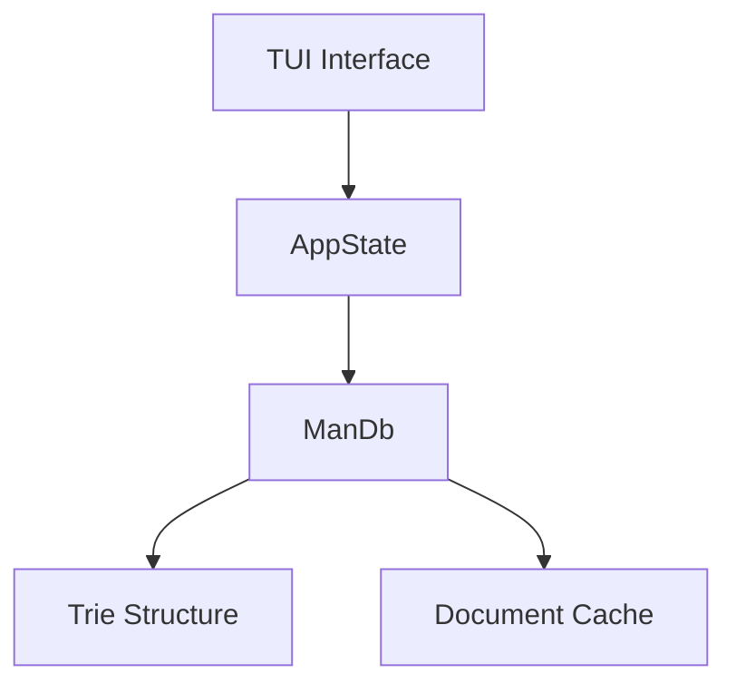

# rtfm

<a id="readme-top"></a>

<div align="center">
  <!--  -->

  <h3>Blazingly fast terminal utility for exploring man pages and tldr cheatsheets</h3>

  <div>
    <a href="https://alexeev-prog.github.io/rtfm/">
        
    </a>
    <a href="https://github.com/alexeev-prog/rtfm/blob/main/LICENSE">
      
    </a>
    <a href="https://github.com/alexeev-prog/rtfm/stargazers">
      
    </a>
  </div>
</div>

<br>

<div align="center">
  
  
  
  
  
  
</div>

<div align="center" style="margin: 15px 0">
  
  
</div>

<div align="center">
  
</div>

 > Read the f*cking manual NOW!

RTFM - blazingly fast util for exploring man pages and tldr cheatsheets.

We are support [tldr](https://github.com/tldr-pages/tldr). You should install `man` and `tldr`.


## Building

```bash
# Clone
git clone https://github.com/alexeev-prog/rtfm
cd rtfm

# Build
cargo build --release

# Run:
./target/release/rtfm -V
```

## Usage

```
Usage: rtfm [OPTIONS] [COMMAND]

Commands:
  getmans  
  getman   
  help     Print this message or the help of the given subcommand(s)

Options:
  -m, --manpage <MANPAGE>  [default: 1]
  -h, --help               Print help
  -V, --version            Print version
```

Вот улучшенный README.md с подробной технической спецификацией и профессиональным оформлением:

## Features

- **Dual-source documentation**: Access both man pages and tldr cheatsheets
- **Instant search**: Trie-based command search with real-time filtering
- **Syntax highlighting**: Intelligent highlighting for documentation content
- **Search within pages**: Find text in documentation with match navigation
- **Caching system**: LRU cache for fast document retrieval
- **Responsive TUI**: Smooth terminal interface with keyboard navigation
- **Debounced input**: Efficient handling of rapid user input

## Technical Architecture

### Core Components


### Data Flow
1. User inputs trigger command filtering
2. Trie structure performs prefix search
3. Selected command fetches document from cache or external source
4. Content is parsed and displayed with syntax highlighting
5. Search queries scan content and highlight matches

## Building and Installation

### Prerequisites
- Rust 1.70+
- Man-db
- tldr (optional but recommended)

### Installation
```bash
# Build from source
cargo install --path .

# Or via cargo
cargo install rtfm
```

### Build Options
```bash
# Debug build
cargo build

# Release build (recommended)
cargo build --release

# Build with all optimizations
RUSTFLAGS="-C target-cpu=native" cargo build --release
```

## Usage

### TUI Mode (Default)
```bash
rtfm
```

### Key Bindings
| Key               | Command List        | Man Page          | Search          |
|-------------------|---------------------|-------------------|-----------------|
| `Tab`             | Switch focus        | Switch focus      | N/A             |
| `↑/↓`             | Navigate commands   | Scroll            | N/A             |
| `Page Up/Down`    | Jump 50 commands    | Jump 30 lines     | N/A             |
| `/`               | N/A                 | Enter search      | N/A             |
| `n/N`             | N/A                 | Next/prev match   | N/A             |
| `t`               | N/A                 | Toggle man/tldr   | N/A             |
| `Enter`           | Load documentation  | N/A               | Apply search    |
| `Esc`             | Clear input         | Focus command     | Cancel search   |

### CLI Commands
```bash
# List commands starting with 'ls'
rtfm getmans ls

# View man page for ls
rtfm getman ls

# Use specific man section
rtfm --section 3 getman printf
```

## Technical Specifications

### Data Structures
- **Trie**: Efficient prefix search for command names
- **LRU Cache**: Caches parsed documentation (size: 100 entries)
- **Arc<Mutex>**: Thread-safe caching with async support

### Algorithms
- **Debounced Input**: 150ms delay before triggering search
- **Scroll Optimization**: Visible range tracking for large lists
- **Syntax Highlighting**: Rule-based text segmentation
- **Search Matching**: Case-insensitive substring matching

### Dependencies
| Crate        | Purpose                     |
|--------------|-----------------------------|
| `crossterm`  | Terminal control            |
| `tui-rs`     | Terminal UI framework       |
| `tokio`      | Async runtime               |
| `regex`      | Man page parsing            |
| `clap`       | Command-line parsing        |
| `anyhow`     | Error handling              |

## Contributing

1. Fork the repository
2. Create feature branch (`git checkout -b feature/improvement`)
3. Commit changes (`git commit -am 'Add new feature'`)
4. Push to branch (`git push origin feature/improvement`)
5. Create new Pull Request

### Development Guidelines
- Follow Rust 2024 edition conventions
- Maintain 85%+ test coverage
- Use `clippy` and `rustfmt` for code quality
- Document public APIs with examples

## License

This project is licensed under the GNU General Public License v3.0 - see the [LICENSE](LICENSE) file for details.

```
Blazingly fast util for searching manuals &amp; docs
Copyright (C) 2025  Alexeev Bronislav

This program is free software: you can redistribute it and/or modify
it under the terms of the GNU General Public License as published by
the Free Software Foundation, either version 3 of the License, or
(at your option) any later version.

This program is distributed in the hope that it will be useful,
but WITHOUT ANY WARRANTY; without even the implied warranty of
MERCHANTABILITY or FITNESS FOR A PARTICULAR PURPOSE.  See the
GNU General Public License for more details.

You should have received a copy of the GNU General Public License
along with this program.  If not, see <https://www.gnu.org/licenses/>.
```
